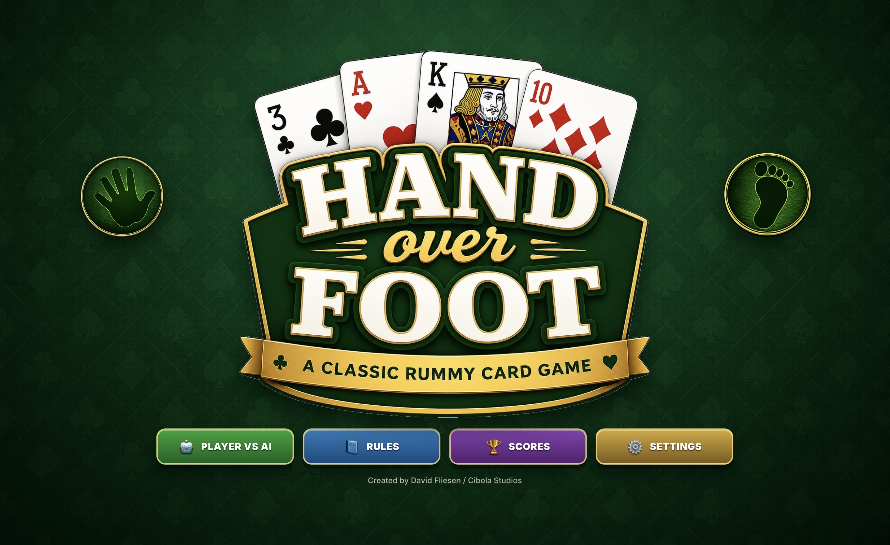

# Hand Over Foot 🃏

  

A free browser-based Hand and Foot Canasta-style card game from the Rummy family.

👉 <a href="https://davidfliesen.github.io/handoverfoot/" target="_blank">Play Online</a>

---

## Features

- Player vs AI gameplay
- Three AI difficulty levels
- Tablet, desktop, and smartphone layouts
- Full screen mode
- Hamburger game menu
- Audio controls and sound effects
- Clean and dirty meld tracking
- MIT open-source license
- Responsive green-felt card table interface

---

## About the Game

Hand Over Foot is inspired by Hand and Foot Canasta, a popular game from the Rummy family of card games. The interface uses approachable “Rummy-style” terminology while the gameplay follows classic Hand and Foot style rules.

The game works best on tablets and desktop computers, but it also supports iPhones and Android phones with a simplified mobile layout.

---

## About the Developer

Hand Over Foot was created by **David Fliesen**, a Hybrid AI / Multimedia Developer focused on artificial intelligence, interactive storytelling, comics, multimedia production, and creative AI workflows.

This browser-based game was rapidly prototyped and refined using both ChatGPT and Claude for coding assistance, gameplay logic, UI refinement, responsive layouts, debugging, and feature development.

### Developer Links

🌐 Portfolio  
https://davidfliesen.github.io/

💼 LinkedIn  
https://www.linkedin.com/in/fliesen/

🎨 Sisters of Summerville  
https://sisters-of-summerville.github.io/

🐙 GitHub  
https://github.com/DavidFliesen

---

## Open Source License

This project is released under the MIT License and is provided “as is” for learning, remixing, experimentation, and further development.

Repository:
https://github.com/DavidFliesen/handoverfoot
