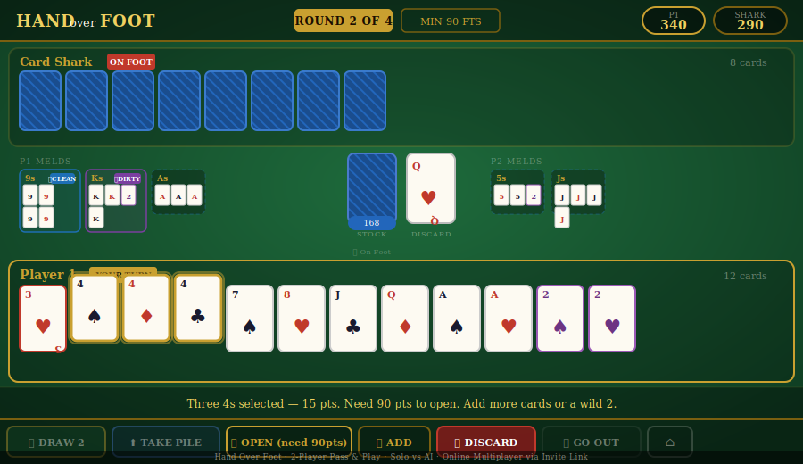

# Hand Over Foot 🃏



> A classic rummy-style card game for 1–2 players — playable in any modern browser on tablet, phone, or desktop. No installation required.

-----

## Play It

**[▶ Play Now on GitHub Pages](https://davidfliesen.github.io/hand-over-foot/)**

-----

## Overview

**Hand Over Foot** is a single-file browser implementation of the Hand and Foot card game — a Canasta variant. Drop `hand-over-foot.html` anywhere and it runs: no build step, no server, no app store. Play solo against an AI opponent at one of three difficulty levels, or challenge a friend online via a peer-to-peer invite link — all hosted on GitHub Pages.

The game runs over **4 rounds**. Players build melds and complete books while racing to go out. The player with the highest cumulative score after all four rounds wins.

-----

## Features

|Feature             |Detail                                               |
|--------------------|-----------------------------------------------------|
|🤖 AI Opponent       |3 difficulty levels — Easy, Club, Shark              |
|📡 Online Multiplayer|Peer-to-peer via invite link — no server needed      |
|📱 Responsive        |iPad, Android tablet, iPhone, desktop                |
|🃏 Complete Rules    |4 rounds, books, wilds, penalties, Go Out            |
|💡 Meld Hints        |Live feedback on opening meld point totals           |
|🔒 AI Lock           |Prevents state corruption between AI and player turns|
|🏠 Navigation        |Logo tap returns to home from anywhere in-game       |

-----

## How to Play

### Setup

- 5 standard decks shuffled together (270 cards including Jokers)
- Each player dealt **11 cards** face-up as their **Hand** and **11 cards** face-down as their **Foot**
- One card flipped to start the discard pile (re-flipped if it is a wild 2)

### Turn Structure

On your turn, **first** do one of:

|Action       |Requirement                                                                                                                 |
|-------------|----------------------------------------------------------------------------------------------------------------------------|
|**Draw 2**   |Take 2 cards from the stock pile                                                                                            |
|**Take Pile**|Pick up the full discard pile — you must hold 2 matching natural cards for the top card rank; top card cannot be a 3 or wild|

Then **meld** and/or **add to melds** as much as you like, and finally **discard** one card to end your turn.

### Melds

- A meld is **3 to 7 cards of the same rank**
- **Natural cards** (4–A, JK) must always **outnumber wild cards (2s)**
- Each rank can only have one meld per player
- Click or tap a meld on the table to add selected cards to it

### Books — Completing a Meld

|Type        |Description                          |Bonus     |
|------------|-------------------------------------|----------|
|🔵 Clean Book|7 natural cards, no wilds            |+500 pts  |
|🟣 Dirty Book|Has wild 2s (naturals still majority)|+300 pts  |
|🟠 Wild Book |All wild 2s — exactly 7              |+1,500 pts|

### Wild Cards

Only **2s** are wild. They can substitute for any natural rank in a meld, as long as natural cards still outnumber them. **Jokers are natural cards** worth 50 pts — they can be melded in their own Joker meld.

### 3s — Penalty Cards ⚠️

3s **cannot be melded**. They sort to the front of your hand as a reminder to discard them.

|Card   |Penalty if left in hand/foot|
|-------|----------------------------|
|Red 3  |−200 pts                    |
|Black 3|−100 pts                    |

Discarding a **Black 3** also blocks the next player from taking the discard pile that turn.

### The Foot Pile

When your Hand runs out, you automatically pick up your **Foot** pile and keep playing.

### Going Out

To end a round you must:

1. Be playing from your **Foot** pile
1. Have completed at least **1 clean book** AND **1 dirty book**
1. Discard your final card (or have none left after melding)

Going out earns a **+100 point bonus**.

### Opening Meld Minimum

Your first meld each round must reach a point total:

|Round|Minimum|
|-----|-------|
|1    |50 pts |
|2    |90 pts |
|3    |120 pts|
|4    |150 pts|

The **New Meld button** shows the current requirement and highlights gold when your selected cards meet it.

-----

## Scoring

### Per-card Values

|Cards            |Points     |
|-----------------|-----------|
|3, 4, 5, 6, 7    |5 pts each |
|8, 9, 10, J, Q, K|10 pts each|
|Ace, 2           |20 pts each|
|Joker            |50 pts each|

### End of Round

**Add** points for:

- All cards in completed and incomplete melds
- Clean Book bonus: +500
- Dirty Book bonus: +300
- Wild Book bonus: +1,500
- Going Out bonus: +100

**Subtract** for cards remaining in hand or foot:

- Red 3: −200 per card
- Black 3: −100 per card
- All others: −face value

-----

## AI Difficulty Levels

|Level         |Name          |Emoji|Behavior                                                                                                                                                                                                                                     |
|--------------|--------------|-----|---------------------------------------------------------------------------------------------------------------------------------------------------------------------------------------------------------------------------------------------|
|🟢 Easy        |Grandma’s Pace|😊    |Always draws from stock. Melds only when 3+ naturals of the same rank are available. No wild strategy. Discards randomly (after dumping 3s). Great for learning.                                                                             |
|🟡 Intermediate|Club Player   |🃏    |Adds to existing melds before starting new ones. Takes the discard pile when holding 2+ matching naturals or has an existing meld for that rank. Dumps 3s first. Uses wilds to complete near-finished melds.                                 |
|🔴 Advanced    |Card Shark    |🦈    |Tracks your meld ranks and avoids discarding cards you need. Takes the pile aggressively. Saves wilds for completing books. Plays Black 3s strategically to block when you are close to going out. Prioritizes speed over score maximization.|

-----

## Multiplayer — Invite Link

Hand Over Foot uses **PeerJS WebRTC** for peer-to-peer multiplayer. No server, no account — works entirely on GitHub Pages.

### Host a Game

1. Tap **Play Now → Host Multiplayer**
1. An invite link is generated, e.g. `https://davidfliesen.github.io/hand-over-foot/?join=abc123`
1. Copy and share it with your opponent via text, email, or any chat app
1. When they open the link and connect, the game starts automatically

### Join a Game

- Open the invite link directly — the game detects `?join=` and prompts connection instantly
- Or tap **Play Now → Join with Code** and paste the link or room code manually

### Notes

- Both players must be online simultaneously
- The host is always Player 1 and goes first in Round 1
- Game state syncs automatically on every action
- If the connection drops, both players need to rejoin and start a new game

-----

## Controls

|Button                       |Action                                                                                     |
|-----------------------------|-------------------------------------------------------------------------------------------|
|**Draw 2**                   |Draw 2 cards from stock                                                                    |
|**Take Pile**                |Pick up the full discard pile                                                              |
|**New Meld / Open**          |Start a new meld with selected cards. Shows point requirement when you have not yet opened.|
|**Add**                      |Add selected cards to an existing meld of matching rank                                    |
|**Discard**                  |Discard 1 selected card and end your turn                                                  |
|**Go Out**                   |End the round — only enabled when all conditions are met                                   |
|**HAND over FOOT** (top-left)|Return to home screen                                                                      |
|**⌂**                        |Return to home screen                                                                      |

**Tips:**

- Tap any meld block on the table to add your currently selected cards to it
- 3s sort to the front of your hand as a visual reminder
- Hover or long-press a 3 for a tooltip showing the penalty
- If you take the pile but cannot form a valid opening meld, the block is released automatically

-----

## File Structure

```
hand-over-foot.html    Complete game — single self-contained file
preview.svg            Screenshot mockup for README and social sharing
README.md              This file
```

Everything runs from one HTML file. No build tools, no package manager, no dependencies beyond CDN-loaded fonts and PeerJS.

-----

## Technical Notes

### Architecture

- **Vanilla HTML5 / CSS3 / JavaScript** — zero frameworks
- **Single file** — all markup, styles, and logic in one 62KB HTML file
- **PeerJS 1.5.2** — WebRTC peer-to-peer signaling for multiplayer

### AI Design

The AI runs on a turn-based `setTimeout` pipeline with an `AI_BUSY` mutex lock to prevent state corruption. All AI actions (`aiDraw`, `aiTakeDiscard`, `aiDiscardCard`, `aiMeldDirect`) bypass player-facing validation functions and manipulate game state directly. This eliminates the class of bug where AI callbacks setting `G.drew = true` would lock the player’s next turn.

### Responsive Layout

- `CSS clamp()` scales cards and UI fluidly across screen sizes
- `touch-action: manipulation` eliminates the 300ms tap delay on Android
- `-webkit-overflow-scrolling: touch` for smooth card row scrolling on iOS
- `user-scalable=no` prevents accidental pinch-zoom during play
- Cards scroll horizontally within player zones to handle large hands

### Meld Validation

- `bestMeldPts()` scans the player’s hand for the highest-scoring valid opening meld (accounting for wilds) and displays it live after drawing
- If a player takes the discard pile but cannot form a valid opening meld meeting the round minimum, `G.tookPile` is released immediately so they can discard without being stuck

### Tested On

- iPad Safari (primary target)
- Android tablet Chrome
- iPhone Safari
- Desktop Chrome, Firefox, Edge

-----

## Known Limitations

- Multiplayer requires both players online simultaneously — no reconnect support
- If the PeerJS signaling server is down, invite links will not connect (fallback: pass-and-play mode always works)
- Game state is not persisted — refreshing ends the game

-----

## IP & Trademark Notes

**Hand Over Foot** is an original title. Prior to use, a USPTO trademark search was conducted for Class 028 (Games and Sporting Goods). No active registration was found for this exact phrase in this class.

The underlying gameplay is derived from the traditional folk card game **Hand and Foot**, a Canasta variant. Under U.S. copyright law, game mechanics and rules are not protectable expression (*DaVinci Editrice S.r.l. v. Ziko Games*, S.D. Tex. 2012). All code, UI design, AI logic, branding, and original rule variations are original works by Cibola Studios.

**Original rule variations in this implementation:**

- Only 2s are wild (Jokers are high-value natural cards, not wilds)
- 3s are penalty cards: Red 3 = −200 pts, Black 3 = −100 pts (neither can be melded)
- Three-tier AI difficulty system (Grandma’s Pace / Club Player / Card Shark)
- Live opening meld point calculator with per-turn feedback

-----

## License

Released under the **MIT License**.

```
MIT License

Copyright (c) 2025 Cibola Studios

Permission is hereby granted, free of charge, to any person obtaining a copy
of this software and associated documentation files (the "Software"), to deal
in the Software without restriction, including without limitation the rights
to use, copy, modify, merge, publish, distribute, sublicense, and/or sell
copies of the Software, and to permit persons to whom the Software is
furnished to do so, subject to the following conditions:

The above copyright notice and this permission notice shall be included in all
copies or substantial portions of the Software.

THE SOFTWARE IS PROVIDED "AS IS", WITHOUT WARRANTY OF ANY KIND, EXPRESS OR
IMPLIED, INCLUDING BUT NOT LIMITED TO THE WARRANTIES OF MERCHANTABILITY,
FITNESS FOR A PARTICULAR PURPOSE AND NONINFRINGEMENT.
```

-----

## Credits

Developed by **David Fliesen / Cibola Studios**
Built with Claude AI — Hybrid Generative AI Multimedia Development

🌐 [davidfliesen.github.io](https://davidfliesen.github.io)
💼 [linkedin.com/in/fliesen](https://linkedin.com/in/fliesen)
🎨 [sisters-of-summerville.github.io](https://sisters-of-summerville.github.io)

-----

*“Hand over Foot — a classic rummy card game, reimagined for modern play.”*