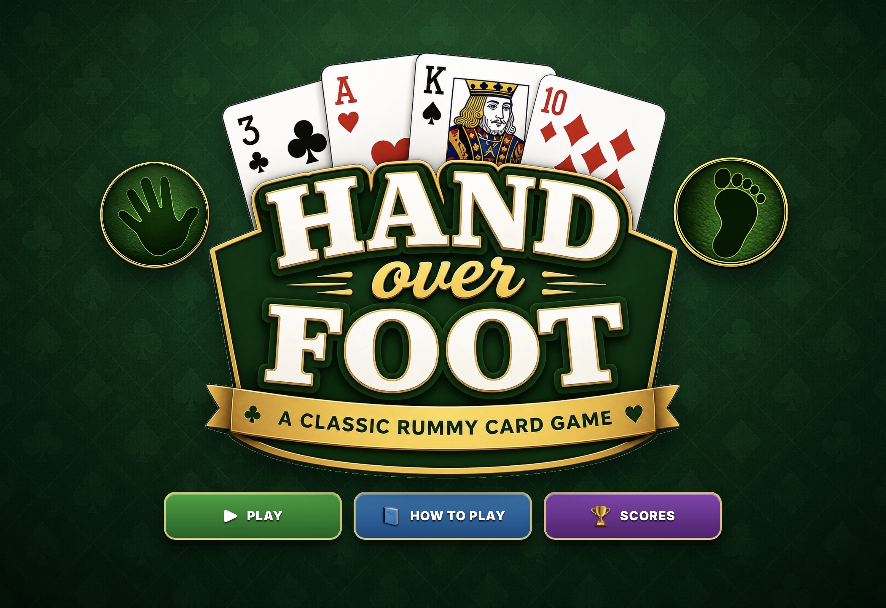

# Hand Over Foot

A modern browser-based single-player adaptation of the classic Hand and Foot Canasta card game.

Play online: https://davidfliesen.github.io/handoverfoot/

## Features

- Single Player vs AI
- Easy, Club, and Shark AI difficulty levels
- AI thinking pauses between actions
- Four-hand game structure
- Opening meld requirements
- Red and black books
- Fullscreen support
- Zoom controls
- Touch-friendly layout
- Subtle sound effects with controls
- Hamburger navigation menu
- Scores, Settings, How to Play, Source Code, and About Developer sections
- Optional Learning Tips mode for new players
- Help button with plain-English guidance and strategy tips

## How to Play

Hand Over Foot is a card-matching game. Build groups of matching cards, turn those groups into books, and empty your Hand and then your Foot before the AI opponent does.

Each hand has an opening meld requirement:

| Hand | Opening Meld |
|---|---:|
| 1 | 50 |
| 2 | 90 |
| 3 | 120 |
| 4 | 150 |

A set needs at least three matching cards. When a set reaches seven cards, it becomes a book.

- Clean/red books have no wild cards and score a 500-point bonus.
- Black books use wild cards and score a 300-point bonus.
- 2s and Jokers are wild.
- 3s cannot be used in sets.

## Safe Navigation

To prevent accidental loss of progress, clicking the **HAND over FOOT** title during a game displays a confirmation dialog before returning to the home screen.

## Developer

**David Fliesen**

Veteran multimedia creator, AI developer, animator, educator, and browser-tool builder.

- Portfolio: https://davidfliesen.github.io/
- GitHub: https://github.com/DavidFliesen
- LinkedIn: https://www.linkedin.com/in/fliesen

## Version

Current Version: **3.7.0**

## Learning Tips

Learning Tips are off by default. They can be turned on from Settings to show small coaching prompts inside the Your Turn panel during play.

The Help button gives plain-English guidance for new players, including what to do next and simple strategy reminders such as when to think about keeping matching cards, when wild cards can be used, and why 3s are usually bad cards to keep.

## AI Timing Fix

AI turns now take one total thinking pause between 2 and 6 seconds, depending on difficulty, instead of stacking several pauses during the same turn.

The AI opening meld logic was also improved so the opponent can combine multiple legal sets to reach the required opening meld, just like the player can.
